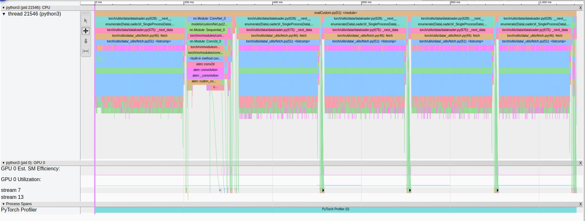
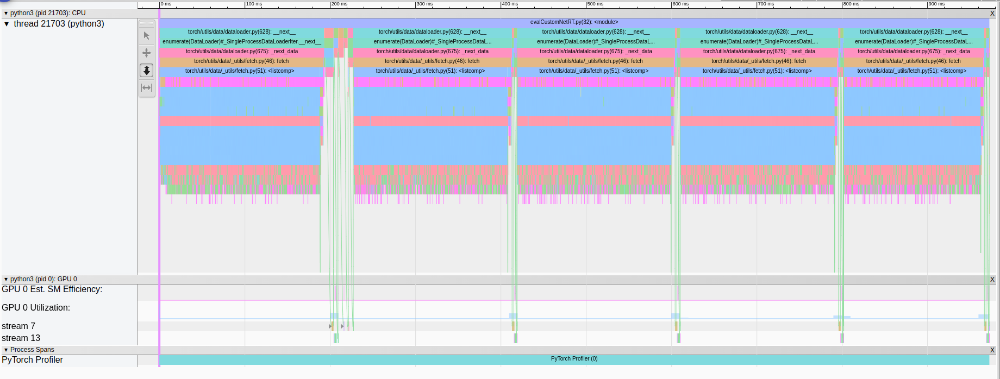
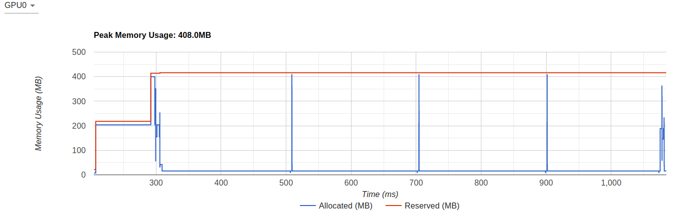
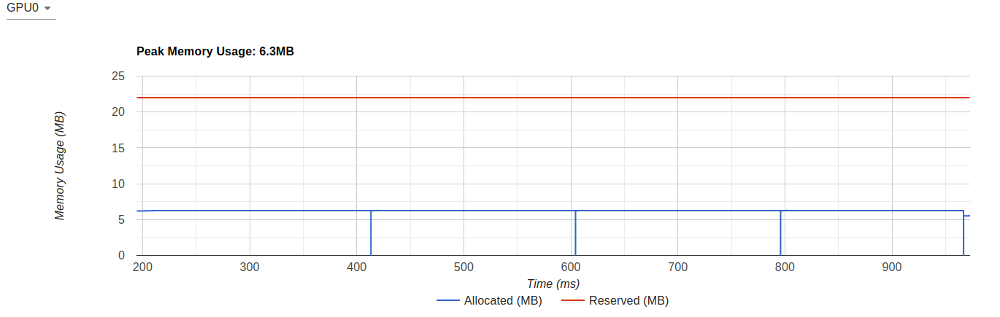

# Entrenar la red 

Usar codigo en `evalCustom.py`, obs: es necesario descomentar la parte que dice "Entrenamiento del modelo" -- ya hare un archivo aparte.

# Construir ONNX

Correr `onnx_transform.py`, recorad cambiar el BATCH_SIZE segun sea necesario.

# Construir ENGINEE

Correr `build_trt.py`, tmb recuerde cambiar BATCH_SIZE, asi como especificar si desa fp32, fp16 o INT8

```
build_trt.py --int8 --input_shape=[128,1, 28, 28] --weights='weights/best128.onnx'
``` 
obs: 128 corresponde al batch size

# Pruebas de TensorRT en una red custom usando pytorch

correr red normal: `python evalCustom.py`

correr red optimizada con TRT: `python evalCustomNetRT.py`

para poder ver los logs generados en los profilers: `tensorboard --logdir=./log`, luego en el navegador de chrome, buscar `http://localhost:6006/`

# Resultados

## TensorBoard Profiler
Estos resultados son obtenidos al correr todo el dataset de purebas (~ 10000 imagenes).
### summary table batch size 2048

|  Model      | Stage           |Time duration (us)    | Percentage (%) |  size (MB)| accuracy (%)|
|-------------|-----------------|----------------------|----------------|-----------|-------------|
| Vanilla     |                 |  1.084.332           |100             |1,7        |99.2         |     
|             | Kernel          |  39.064              | 3,6            |||
|             | Memcpy          |  9.708               | 0,9            |||
|             | CPU Exec        |  436.668             | 40,27          |||
|             | Other           |  598.889             | 55.23          |||
| TRT fp16    |                 |  972.304             |100             |1,1        |99.18        |
|             | Kernel          |  17.783              |1,83            |||        
|             | Memcpy          |  9.710               |1               |||     
|             | CPU Exec        |  344.756             |35,46           |||
|             | Other           |  600.055             |61.71           |||
| TRT fp32    |                 |  1,091,613           |100             |2,1        |98.97         |
|             | Kernel          |  19,417              |1.78            |||        
|             | Memcpy          |  9,722               |0.89            |||     
|             | CPU Exec        |  414,413             |37.96           |||
|             | Other           |  648,061             |59.37           |||

* obs: Kernel: kernel execution time on GPU device;
       Memcpy: GPU involved memory compy time;
       Memset: GPU involved memory set time;
       Runtime: CUDA runtime execution time on host side (such as cudaLaunchKernel);
       DataLoader: The data loading time spent in PyTorch DataLoader object;
       CPU Exec: Host compute time, including every Pytorch operator running time;
       Other: time not incuded in the above
* obs: los que no aparecen en la tabla son porque son 0%

--- 

### vanilla trace batch size 2048

<div align="center">
      <a href="">
     
      </a>
</div>

### trt trace batch size 2048

<div align="center">
      <a href="">
     
      </a>
</div>

---

### vanilla mem batch size 2048

<div align="center">
      <a href="">
     
      </a>
</div>

### trt mem batch size 2048

<div align="center">
      <a href="">
     
      </a>
</div>

---
## tablas antiguas
### CustomNet batch size 64
|  Model      | Stage           |size MB |Time CPU %           | Time CUDA % |# of calls | accuracy % | 
|-------------|-----------------|--------|---------------------|-------------|-----------|------------|
| Vanilla     |                 |1.7     |100% (87 ms)         |100% (351 us)|           |100%        |
|             | inference       |        |~48.00%              |100%         |           ||
|             | cudaLaunchKernel|        |26.81%               |0%           |15         ||
|             | cudaFree        |        |11.68%               |0%           |4          ||
| TRT fp16    |                 |1.1     |100% (5.425 ms)      |100% (72 us) |           |100%        |
|             | inference       |        |0%                   |100%         |           ||
|             | cudaLaunchKernel|        |63.14%               |0%           |3          ||
|             | cudaFree        |        |36.18%               |0%           |2          ||


### CustomNet batch size 128
|  Model      | Stage           |size MB |Time CPU %           | Time CUDA % |# of calls | accuracy % | 
|-------------|-----------------|--------|---------------------|-------------|-----------|------------|
| Vanilla     |                 |1.7     |100% (81.809 ms)     |100% (613 us)|           |99.218%        |
|             | inference       |        |~50.00%              |100%         |           ||
|             | cudaLaunchKernel|        |26.68%               |0%           |13         ||
|             | cudaFree        |        |11.83%               |0%           |4          ||
| TRT fp16    |                 |1.1     |100% (3.480 ms)      |100% (131 us) |           |99.218%        |
|             | inference       |        |0%                   |100%         |           ||
|             | cudaLaunchKernel|        |64.97%               |0%           |3          ||
|             | cudaFree        |        |34.45%               |0%           |2          ||

---

obs: * resultados obtenidos corriendo las redes en un solo batch de 64/128 imagenes.
    * El tamaño del modelo Vanilla hace referencia al modelo pasado a onnx.
    * Stage inference hace referencia al tiempo de procesamiento usado en las capas de la red para la inferenica en las imagenes

# Referencias

* pytorch profiler stable: `https://pytorch.org/docs/stable/profiler.html`
* profiler pytorch: `https://pytorch.org/tutorials/recipes/recipes/profiler_recipe.html`
* profiler pytorch blog: `https://levelup.gitconnected.com/pytorch-official-blog-detailed-pytorch-profiler-v1-9-7a5ca991a97b`
* profiler tensor board: `https://pytorch.org/tutorials/intermediate/tensorboard_profiler_tutorial.html`
* INT8 calibration examples: `https://forums.developer.nvidia.com/t/tensorrt-5-int8-calibration-example/71828/9`
* INT8 calibration github example: `https://github.com/rmccorm4/tensorrt-utils/blob/master/int8/calibration/ImagenetCalibrator.py`